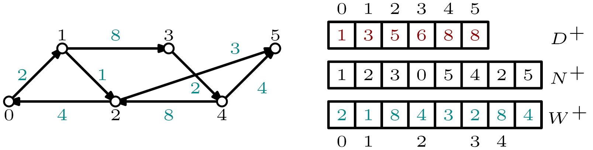

# [Directed Louvain algorithm](#mainpage)                       

The algorithm used in this package is based on the Louvain algorithm developed by V. Blondel, J.-L. Guillaume, R. Lambiotte, E. Lefebvre and was downloaded on the [Louvain algorithm webpage](https://sites.google.com/site/findcommunities/) (**[1]**).
The algorithm was then adjusted to handle directed graphs and to optimize directed modularity of Arenas _et al._ (**[2]**).
These modifications were mostly made by [Anthony perez](https://www.univ-orleans.fr/lifo/membres/Anthony.Perez) and by [Nicolas Dugué](https://lium.univ-lemans.fr/team/nicolas-dugue/).

The directed modularity is proved to be more efficient in the case of directed graphs as shown in [Direction matters in complex networks: A theoretical and applied study for greedy modularity optimization](https://doi.org/10.1016/j.physa.2022.127798) and [Directed Louvain : maximizing modularity in directed networks](https://hal.archives-ouvertes.fr/hal-01231784) (**[3,4]**). **For any citation of this work please use the following**: 

    @article{DP22,
        author  = {Nicolas Dugué and Anthony Perez},
        title   = {Direction matters in complex networks: A theoretical and applied study for greedy modularity optimization},
        journal = {Physica A: Statistical Mechanics and its Applications},
        volume  = {603},
        pages   = {127798},
        year    = {2022},
        issn    = {0378-4371},
        doi     = {https://doi.org/10.1016/j.physa.2022.127798},
    }
---
## How to use

The algorithm works in two steps, namely computing communities and then displaying hierarchical tree. Note that the algorithme computes a hierarchical community structure, with several levels. More information are given below regarding the meaning and use of such levels. 

### Computing communities

The graph **must** be in edgelist format, that is one edge per line as follows (the `weight` being optional):  

    src dest [weight]

Weighted graphs are automatically recognized by the program and there is no need to specify it in the command line. 
Moreover, it is **mandatory** that vertices of the input graph are numbered from `0` to `n-1`. 
To ensure a proper computation of the communities, the default computation encompasses a renumbering of the input graph. 
The option `-n` indicates that the graph is already numbered from `0` to `n-1` and hence avoids renumbering. 
**Important**: communities are written using the **original label nodes**.

The standard command is:

    ./bin/community -f graph/graph.txt -l -1 -v > graph.tree

Several options are available, among which:
+ `-f` path to the input graph (edgelist or binary format (`.bin`))
+ `-g` value of the resolution parameter: the algorithm favors larger communities if less than 1 and smaller otherwise
+ `-n` to indicate that the input graph is correctly numbered (from `0` to `n-1`)
+ `-r` for reproducibility purposes: the renumbered graph is stored on hard drive.
+ `-s` for disabling randomness: the algorithm will consider vertices from `0` to `n-1`

More options and information are provided using `./bin/community`

Another possibility is to pass a binary file containing all information regarding the graph. 
**We strongly recommand to generate the binary file using our program in a first place**, even if any file following the CSR format will do (see below for more information regarding binary file format). 

### [Graph representation: CSR format](#CSR)

Graphs are stored under the [Compressed Sparse Row (CSR)](https://en.wikipedia.org/wiki/Sparse_matrix#Compressed_sparse_row_(CSR,_CRS_or_Yale_format)) format.  
Several structures are containing the whole graph information: 
+ two arrays of **cumulative degrees** (out- and in-degrees): for out-degrees, each index _i_ contains the sum of all out-degrees for nodes from _0_ to _i_. 
+ two arrays of outcoming and incoming **arcs**: the _d(0)_ (out- or in-degree of node _0_) first values contain neighbors of node _0_ and so on.   
To find the first neighbor of a given node _i_ one simply needs to consider the difference between cumulative degrees of _i_ and _i-1_.
+ two array of outcoming and incoming **weights**: similar to the previous ones but store weights instead of node identifiers. 

Example of CSR format for a directed graph. The displayed arrays contain information regarding out-neighbors and weighted out--degrees only.

## Examples 
Using `examples/graph.txt` one obtains: 

    ./bin/community -f examples/graph.txt -l -1 -v -r > examples/graph.tree

to compute hierarchical community structure (using **original** label nodes) 
by first renumbering the graph, and 
then writing files for reproducibility. The next runs would thus be: 

    ./bin/community -f examples/graph.txt -l -1 > examples/graph.tree

Another useful value for `-l` is `-2`, which computes only the last level of the hierarchical structure. 
Finally, using an already renumbered graph one gets: 

    ./bin/community -f examples/graph_renum.txt -l -1 -v -n > examples/graph.tree

The program can also start with any given partition using -p option

    ./bin/community -f examples/graph.txt -p examples/graph.part -v

### Improvements

To ensure a faster computation (with a loss of quality), one can use
the -q option to specify that the program must stop if the increase of
modularity is below epsilon for a given iteration or pass:

    ./bin/community examples/graph.txt -l -1 -q 0.0001 > examples/graph.tree

-----------------------------------------------------------------------------
**Display communities information**

Displays information on the tree structure (number of hierarchical
levels and nodes per level):

    ./hierarchy graph.tree

Displays the belonging of nodes to communities for a given level of
the tree:

    ./hierarchy graph.tree -l 2 > graph_node2comm_level2

The option `-l -1` displays information regarding the hierarchical structure, including number of levels. 

-----------------------------------------------------------------------------
## References
* **[1]** Vincent D. Blondel, Jean-Loup Guillaume, Renaud Lambiotte, Etienne Lefebvre. [Fast unfolding of communities in large networks](https://arxiv.org/pdf/0803.0476.pdf). Journal of Statistical Mechanics: Theory and Experiment, 2008, vol. 2008, no 10, p. P10008.
* **[2]** Alexandre Arenas, Jordi Duch, Alberto Fern\'andez, Sergio G\'omez. [Size reduction of complex networks preserving modularity](https://iopscience.iop.org/article/10.1088/1367-2630/9/6/176/pdf). New Journal of Physics 9, 176, 2007.
* **[3]** Nicolas Dugué, Anthony Perez. [Direction matters in complex networks: A theoretical and applied study for greedy modularity optimization](https://doi.org/10.1016/j.physa.2022.127798). Physica A: Statistical Mechanics and its Applications, 603, 2022.
* **[4]** Nicolas Dugué, Anthony Perez. [Directed Louvain: maximizing modularity in directed networks](https://hal.archives-ouvertes.fr/hal-01231784/document). Research Report, Université d'Orléans. 2015.
